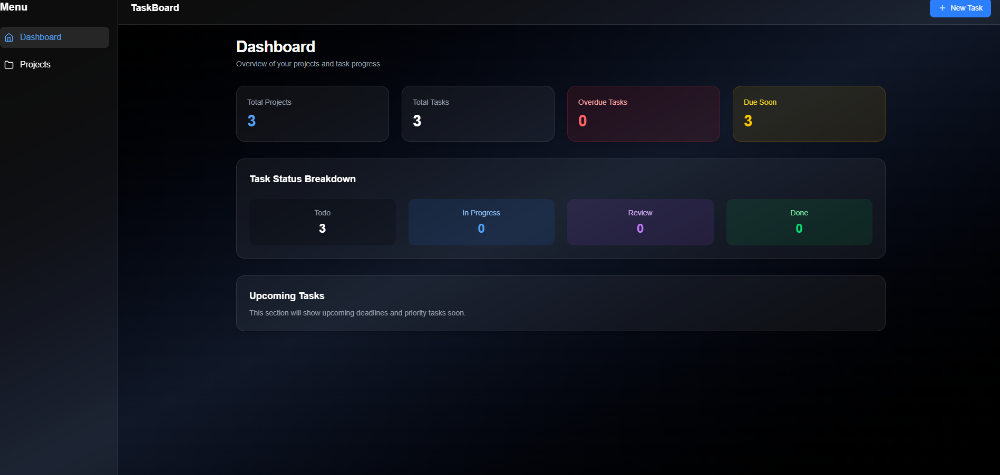
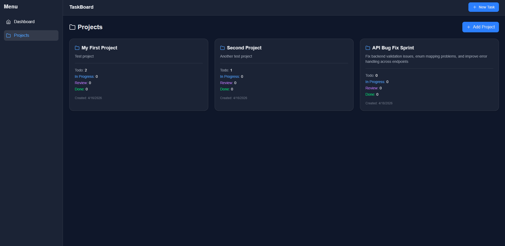
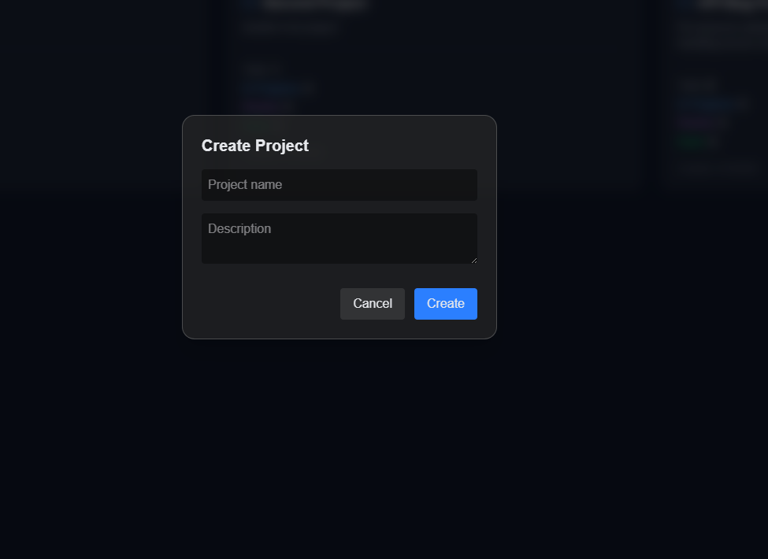
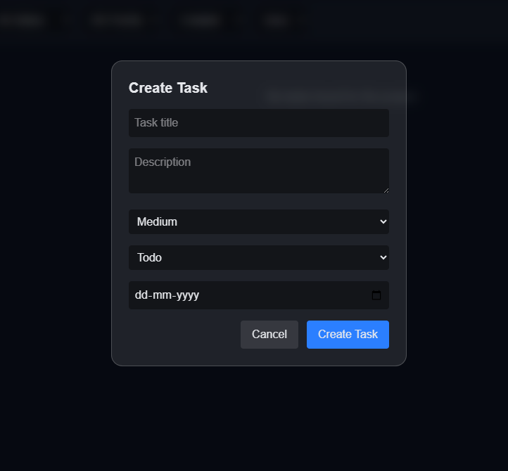

# 📌 TaskBoard – Project Task Management System

A full-stack project management application built with **React + ASP.NET Core Web API + SQLite (EF Core)**.

It allows users to manage projects, tasks, and track progress with filtering, sorting, pagination, and dashboard analytics.

---

## 🚀 Features

### 📁 Project Management
- Create / View / Delete projects
- Task summary per project (Todo, In Progress, Review, Done)
- Cascade delete support

### ✅ Task Management
- Create, update, delete tasks
- Priority levels: Low / Medium / High / Critical
- Status tracking: Todo / In Progress / Review / Done
- Due date validation (future only)
- Filtering + Sorting + Pagination

### 📊 Dashboard
- Total projects & tasks
- Task status breakdown
- Overdue task tracking
- Due soon stats

### 💬 Comments System
- Add comments on tasks
- View task activity

---

## 🧱 Tech Stack

### Frontend
- React.js
- React Router
- Axios
- React Toastify
- Tailwind CSS

### Backend
- ASP.NET Core Web API
- Entity Framework Core
- SQLite Database
- C# Services + Interfaces architecture

---

## 🗂️ Project Structure

### Backend                                
TaskBoard.Api/
├── Controllers
├── Services
├── Models
├── Data (DbContext + Migrations)
├── Middleware


### Frontend
src/
├── pages
├── components
├── api
├── hooks


---

## ⚙️ Setup Instructions

### 🔧 Backend

```bash
cd TaskBoard.Api
dotnet restore
dotnet ef database update
dotnet run
```
Runs on: http://localhost:5143

💻 Frontend
```
cd frontend
npm install
npm run dev
```

Runs on: http://localhost:5173

🗄️ Database
1. SQLite used via EF Core
2. Migrations included
3. Relationships:
     Project → Tasks (1:M)
     Task → Comments (1:M)


📌 API Endpoints
Projects
```
GET /api/projects
POST /api/projects
GET /api/projects/{id}
DELETE /api/projects/{id}
```
Tasks
```
GET /api/projects/{projectId}/tasks
POST /api/projects/{projectId}/tasks
GET /api/tasks/{id}
PUT /api/tasks/{id}
DELETE /api/tasks/{id}
```
Comments
```
GET /api/tasks/{taskId}/comments
POST /api/tasks/{taskId}/comments
```
Dashboard
```
GET /api/dashboard
```
🧪 Key Features Implemented
Filtering (status, priority)
Sorting (createdAt, dueDate, priority)
Pagination (page + pageSize)
Validation in backend service layer
Global exception handling (basic)
Toast notifications in frontend
Modal-based UI for create operations
📸 Screenshots
## 📊 Dashboard View



### 📁 Projects


### ➕ Create Project


### 📝 Create Task



🧠 What I Learned
Full-stack architecture separation
EF Core relationships + migrations
API design using service pattern
React state management + hooks
Real-world CRUD system design
📦 Future Improvements
Authentication (JWT)
Drag & drop Kanban board
Real-time updates (SignalR)
Better UI animations

